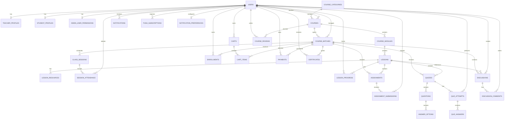
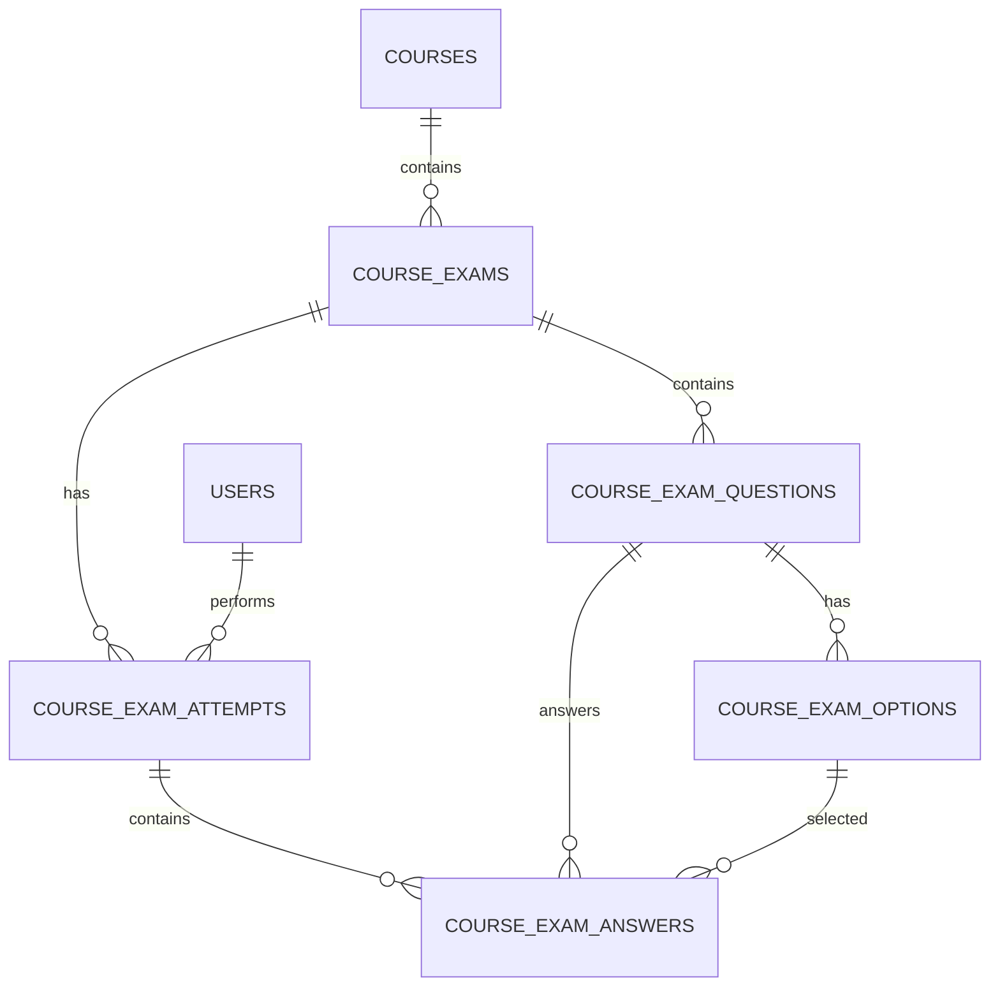

# PHÂN TÍCH ĐỐI TƯỢNG, CHỨC NĂNG VÀ THIẾT KẾ CƠ SỞ DỮ LIỆU

## 1. Thông tin chung

- Tên phần mềm: **LearnX E-learning System**.
- Loại hệ thống: Website quản lý và cung cấp khóa học trực tuyến/kết hợp.
- Kiến trúc: React + TypeScript, Express.js, MySQL.
- Cơ sở dữ liệu: `elearning_system`.
- Phạm vi: khách truy cập, học viên, giảng viên, quản trị viên và các dịch vụ
  tích hợp bên ngoài.
- Ngày cập nhật: 22/06/2026.

## 2. Liệt kê các đối tượng sử dụng phần mềm

### 2.1 Khách truy cập

Khách truy cập là người chưa đăng nhập hoặc chưa có tài khoản. Đối tượng này sử
dụng phần công khai của hệ thống để tìm hiểu khóa học và giảng viên.

Mục tiêu:

- Tìm khóa học phù hợp.
- Xem thông tin khóa học, lớp mở và lịch dự kiến.
- Xem hồ sơ giảng viên.
- Đăng ký hoặc đăng nhập để mua khóa học.

### 2.2 Học viên

Học viên là người có tài khoản với vai trò `STUDENT`.

Mục tiêu:

- Chọn khóa học và lớp học phù hợp.
- Thanh toán học phí.
- Truy cập nội dung học tập.
- Làm bài kiểm tra, nộp bài tập và theo dõi kết quả.
- Theo dõi lịch học, tiến độ và chứng chỉ.
- Trao đổi với giảng viên và các học viên cùng lớp.

### 2.3 Giảng viên

Giảng viên là người có tài khoản với vai trò `TEACHER`.

Mục tiêu:

- Xây dựng và quản lý khóa học.
- Mở các lớp học cho cùng một khóa.
- Quản lý nội dung, lịch học, điểm danh và đánh giá học viên.
- Tạo bài tập, quiz và chấm điểm.
- Tương tác với học viên.
- Theo dõi số liệu giảng dạy.

### 2.4 Quản trị viên

Quản trị viên là người có tài khoản với vai trò `ADMIN`.

Mục tiêu:

- Kiểm soát tài khoản người dùng.
- Duyệt khóa học trước khi công khai.
- Quản lý nội dung và cấu hình hệ thống.
- Theo dõi tình trạng vận hành chung.
- Phân quyền nghiệp vụ cho từng quản trị viên.

### 2.5 Hệ thống thanh toán VNPAY

VNPAY không phải người dùng trực tiếp nhưng là một tác nhân ngoài hệ thống.

Vai trò:

- Nhận yêu cầu thanh toán từ LearnX.
- Hiển thị cổng thanh toán Sandbox.
- Trả kết quả giao dịch và chữ ký xác thực.

### 2.6 Dịch vụ Web Push và trình duyệt

Đây là tác nhân kỹ thuật hỗ trợ thông báo.

Vai trò:

- Nhận đăng ký Push Subscription từ trình duyệt.
- Nhận thông báo đẩy khi người dùng cho phép.
- Điều hướng người dùng đến đối tượng liên quan trong hệ thống.

## 3. Chức năng của từng đối tượng

## 3.1 Chức năng dùng chung

| Mã | Chức năng | Khách | Học viên | Giảng viên | Admin |
| --- | --- | :---: | :---: | :---: | :---: |
| UC-C01 | Xem trang chủ | X | X |  |  |
| UC-C02 | Xem danh mục khóa học | X | X |  |  |
| UC-C03 | Tìm kiếm và lọc khóa học | X | X |  |  |
| UC-C04 | Xem chi tiết khóa học | X | X |  |  |
| UC-C05 | Xem hồ sơ giảng viên | X | X |  |  |
| UC-C06 | Đăng nhập |  | X | X | X |
| UC-C07 | Đăng xuất |  | X | X | X |
| UC-C08 | Xem và cập nhật hồ sơ cá nhân |  | X | X |  |
| UC-C09 | Xem thông báo |  | X | X | X |
| UC-C10 | Đánh dấu thông báo đã đọc |  | X | X | X |

## 3.2 Chức năng của khách truy cập

### UC-G01 - Xem danh sách khóa học công khai

Khách được xem các khóa có trạng thái `APPROVED` và còn ít nhất một lớp đang
nhận đăng ký.

Thông tin hiển thị:

- Tên khóa học.
- Danh mục.
- Giảng viên.
- Cấp độ.
- Giá tham khảo.
- Số bài học.
- Điểm đánh giá.

### UC-G02 - Xem chi tiết khóa học

Khách được xem:

- Mô tả khóa học.
- Chương trình và số bài học.
- Các lớp còn nhận đăng ký.
- Hình thức online, offline hoặc hybrid.
- Lịch học định kỳ.
- Học phí của lớp.
- Đánh giá khóa học và giảng viên.

Khách không được:

- Thêm lớp vào giỏ hàng.
- Truy cập bài học đầy đủ.
- Làm quiz hoặc nộp bài.
- Tham gia thảo luận lớp.

### UC-G03 - Đăng ký tài khoản học viên

Thông tin:

- Họ tên.
- Email.
- Số điện thoại.
- Mật khẩu.

Ràng buộc:

- Email không được trùng.
- Số điện thoại không được trùng.
- Tài khoản mới có role `STUDENT`.
- Tài khoản được tạo ở trạng thái `ACTIVE`.

## 3.3 Chức năng của học viên

### Nhóm A - Tài khoản và hồ sơ

| Mã | Chức năng | Mô tả |
| --- | --- | --- |
| UC-S01 | Đăng nhập | Đăng nhập bằng email hoặc số điện thoại |
| UC-S02 | Ghi nhớ đăng nhập | Kéo dài thời gian session khi chọn ghi nhớ |
| UC-S03 | Xem hồ sơ | Xem họ tên, email, điện thoại, avatar và thông tin cá nhân |
| UC-S04 | Cập nhật hồ sơ | Cập nhật họ tên, điện thoại, avatar và hồ sơ học viên |
| UC-S05 | Xem lịch sử thanh toán | Xem các giao dịch và trạng thái |
| UC-S06 | Xem chứng chỉ | Xem chứng chỉ đã được cấp |
| UC-S07 | Đăng xuất | Thu hồi session hiện tại |

### Nhóm B - Khóa học, lớp và thanh toán

| Mã | Chức năng | Mô tả |
| --- | --- | --- |
| UC-S08 | Xem catalog | Xem các khóa còn lớp nhận đăng ký |
| UC-S09 | Chọn lớp | Chọn một lớp cụ thể trong khóa |
| UC-S10 | Thêm giỏ hàng | Thêm `batch_id` cùng giá tại thời điểm chọn |
| UC-S11 | Đổi lớp trong giỏ | Chỉ giữ một lớp cho cùng một khóa |
| UC-S12 | Xóa khỏi giỏ | Xóa lớp không muốn mua |
| UC-S13 | Thanh toán VNPAY | Tạo URL có chữ ký và chuyển đến VNPAY |
| UC-S14 | Nhận kết quả thanh toán | Xác thực chữ ký, tạo payment và enrollment |
| UC-S15 | Xem khóa đã mua | Xem khóa và lớp đã ghi danh |

Quy tắc chọn lớp:

1. Một học viên chỉ được chọn một lớp trong cùng một khóa.
2. Lớp phải có trạng thái `OPEN` hoặc `STARTED`.
3. Ngày hiện tại phải nằm trong thời gian nhận đăng ký.
4. Sĩ số chưa đạt `max_students`.
5. Học viên chưa ghi danh lớp khác của cùng khóa.

### Nhóm C - Học tập

| Mã | Chức năng | Mô tả |
| --- | --- | --- |
| UC-S16 | Xem chương học | Xem module của khóa đã mua |
| UC-S17 | Xem bài học | Xem video, bài đọc, PDF hoặc buổi live |
| UC-S18 | Xem tài nguyên | Tải tài liệu gắn với bài học |
| UC-S19 | Cập nhật tiến độ | Đánh dấu bài học đã hoàn thành |
| UC-S20 | Xem phần trăm hoàn thành | Tính theo số bài đã hoàn tất |
| UC-S21 | Xem lịch học | Xem các buổi của đúng lớp đã mua |
| UC-S22 | Tham gia buổi online | Mở link Zoom/Meet/Teams/Jitsi |
| UC-S23 | Xem thông tin phòng học | Xem phòng và địa chỉ với lớp offline |

### Nhóm D - Quiz, bài kiểm tra và bài tập

| Mã | Chức năng | Mô tả |
| --- | --- | --- |
| UC-S24 | Xem quiz theo bài/lớp | Chỉ thấy quiz trong phạm vi ghi danh |
| UC-S25 | Bắt đầu quiz | Tạo lần làm bài |
| UC-S26 | Trả lời quiz | Chọn đáp án và nộp bài |
| UC-S27 | Xem điểm quiz | Xem điểm sau khi hệ thống/giảng viên chấm |
| UC-S28 | Xem bài kiểm tra | Xem đề kiểm tra cấp khóa |
| UC-S29 | Lưu nháp bài kiểm tra | Lưu câu trả lời đang làm |
| UC-S30 | Nộp bài kiểm tra | Chuyển attempt sang trạng thái đã nộp |
| UC-S31 | Xem lại kết quả | Xem đáp án, điểm và phản hồi |
| UC-S32 | Xem bài tập theo bài học | Bài tập có `lesson_id` và phạm vi lớp |
| UC-S33 | Nộp bài tập | Nộp file hoặc nội dung |
| UC-S34 | Xem điểm và phản hồi | Xem kết quả giảng viên chấm |

### Nhóm E - Tương tác

| Mã | Chức năng | Mô tả |
| --- | --- | --- |
| UC-S35 | Tạo thảo luận | Tạo chủ đề trong lớp/bài học |
| UC-S36 | Bình luận | Phản hồi chủ đề |
| UC-S37 | Trả lời bình luận | Tạo luồng bằng `parent_comment_id` |
| UC-S38 | Thả reaction | Like một chủ đề |
| UC-S39 | Đánh dấu đã giải quyết | Cập nhật trạng thái chủ đề của bản thân |
| UC-S40 | Báo cáo nội dung | Báo cáo discussion, comment hoặc review |
| UC-S41 | Đánh giá khóa học | Chấm điểm khóa và giảng viên |
| UC-S42 | Chỉnh sửa đánh giá | Cập nhật đánh giá đã gửi |
| UC-S43 | Xem phản hồi giảng viên | Xem `teacher_comment` |

## 3.4 Chức năng của giảng viên

### Nhóm A - Dashboard và hồ sơ

| Mã | Chức năng | Mô tả |
| --- | --- | --- |
| UC-I01 | Đăng nhập/đăng ký | Sử dụng cổng Instructor riêng |
| UC-I02 | Xem dashboard | Tổng hợp khóa, lớp, học viên, việc cần xử lý |
| UC-I03 | Xem/cập nhật hồ sơ | Cập nhật chuyên môn, kinh nghiệm, bằng cấp |
| UC-I04 | Xem thông báo | Khóa chờ duyệt, bài cần chấm, câu hỏi, lịch học |
| UC-I05 | Đánh dấu đã đọc | Cập nhật trạng thái notification |

### Nhóm B - Quản lý khóa học

| Mã | Chức năng | Mô tả |
| --- | --- | --- |
| UC-I06 | Tạo khóa học | Tạo khóa ở trạng thái `DRAFT` |
| UC-I07 | Sửa khóa học | Sửa tên, mô tả, giá, ảnh, cấp độ, danh mục |
| UC-I08 | Xóa khóa học | Chỉ xóa khóa thuộc quyền sở hữu |
| UC-I09 | Gửi duyệt | Chuyển `DRAFT` sang `PENDING` |
| UC-I10 | Xem trạng thái duyệt | Xem approved/rejected và lý do |
| UC-I11 | Xem trước khóa | Xem cách nội dung hiển thị cho học viên |

### Nhóm C - Quản lý chương và bài học

| Mã | Chức năng | Mô tả |
| --- | --- | --- |
| UC-I12 | Tạo/sửa/xóa chương | Quản lý `course_modules` |
| UC-I13 | Sắp xếp chương | Cập nhật `order_no` |
| UC-I14 | Tạo/sửa/xóa bài | Quản lý `lessons` |
| UC-I15 | Sắp xếp bài | Cập nhật thứ tự trong chương |
| UC-I16 | Nhập nhiều bài | Bulk import danh sách bài học |
| UC-I17 | Gắn video/bài đọc | Quản lý content, video và loại bài |
| UC-I18 | Quản lý tài nguyên | Tài liệu đính kèm bài học |

Nội dung chương và bài học thuộc khóa học, vì vậy tất cả lớp của cùng khóa dùng
chung chương trình học.

### Nhóm D - Quản lý lớp và lịch học

| Mã | Chức năng | Mô tả |
| --- | --- | --- |
| UC-I19 | Mở lớp | Tạo `course_batches` cho khóa |
| UC-I20 | Sửa/xóa lớp | Quản lý thời gian, sĩ số, học phí và hình thức |
| UC-I21 | Tạo buổi học | Tạo một `class_session` |
| UC-I22 | Tạo lịch định kỳ | Sinh nhiều buổi theo thứ trong tuần |
| UC-I23 | Sửa/xóa buổi | Cập nhật thời gian, link/phòng và trạng thái |
| UC-I24 | Điểm danh | Ghi nhận có mặt, trễ, vắng phép hoặc vắng |

Quy tắc lịch:

- Buổi học phải nằm trong ngày bắt đầu/kết thúc của lớp.
- Giờ kết thúc phải sau giờ bắt đầu.
- Không tạo hai buổi bị chồng thời gian trong cùng lớp.
- Offline dùng phòng học; online dùng URL và nền tảng họp.

### Nhóm E - Quiz, bài tập và chấm điểm

| Mã | Chức năng | Mô tả |
| --- | --- | --- |
| UC-I25 | Tạo quiz | Gắn quiz với bài học |
| UC-I26 | Chọn phạm vi quiz | Một lớp hoặc tất cả lớp trong khóa |
| UC-I27 | Quản lý câu hỏi | Trắc nghiệm, đúng/sai hoặc câu hỏi khác |
| UC-I28 | Quản lý đáp án | Đáp án và đáp án đúng |
| UC-I29 | Chấm quiz | Chấm attempt cần can thiệp |
| UC-I30 | Tạo bài tập | Gắn assignment với bài học |
| UC-I31 | Chọn phạm vi bài tập | Một lớp hoặc tất cả lớp trong khóa |
| UC-I32 | Sửa/xóa bài tập | Cập nhật hạn nộp, điểm tối đa |
| UC-I33 | Chấm bài nộp | Nhập điểm và phản hồi |

Trong database hiện tại:

- `assignments.batch_id`: lớp nhận bài tập.
- `assignments.lesson_id`: bài học chứa bài tập.
- `quizzes.batch_id`: lớp nhận quiz.
- `quizzes.lesson_id`: bài học chứa quiz.

Khi chọn “tất cả lớp”, backend tạo bản ghi tương ứng cho từng `batch_id` của
khóa học.

### Nhóm F - Học viên, tương tác và phân tích

| Mã | Chức năng | Mô tả |
| --- | --- | --- |
| UC-I34 | Xem danh sách học viên | Xem học viên trong các lớp phụ trách |
| UC-I35 | Xem tiến độ/chuyên cần | Xem progress và attendance |
| UC-I36 | Ghi chú can thiệp | Lưu ghi chú và hành động tiếp theo |
| UC-I37 | Trả lời thảo luận | Bình luận với cờ câu trả lời giảng viên |
| UC-I38 | Phản hồi đánh giá | Ghi `teacher_comment` |
| UC-I39 | Xem analytics | Thống kê khóa, học viên, điểm và doanh thu |
| UC-I40 | Xuất dữ liệu | Xuất danh sách điểm/thống kê ở giao diện hỗ trợ |

## 3.5 Chức năng của quản trị viên

### Nhóm A - Quản lý người dùng

| Mã | Chức năng | Mô tả |
| --- | --- | --- |
| UC-A01 | Xem dashboard | Thống kê người dùng, khóa và hoạt động |
| UC-A02 | Xem danh sách học viên | Tìm kiếm, lọc, xem chi tiết |
| UC-A03 | Khóa/mở học viên | Cập nhật trạng thái tài khoản |
| UC-A04 | Xem danh sách giảng viên | Tìm kiếm, lọc, xem hồ sơ |
| UC-A05 | Khóa/mở giảng viên | Cập nhật trạng thái tài khoản |
| UC-A06 | Phân quyền admin | Quyền users, courses, finance, system |

### Nhóm B - Quản lý khóa học

| Mã | Chức năng | Mô tả |
| --- | --- | --- |
| UC-A07 | Xem khóa học | Xem khóa theo trạng thái |
| UC-A08 | Xem nội dung chờ duyệt | Xem thông tin và chương trình |
| UC-A09 | Duyệt khóa | Chuyển sang `APPROVED` |
| UC-A10 | Từ chối khóa | Chuyển sang `REJECTED` và lưu lý do |
| UC-A11 | Ẩn khóa | Không cho xuất hiện ở catalog |

### Nhóm C - Cấu hình và nội dung

| Mã | Chức năng | Mô tả |
| --- | --- | --- |
| UC-A12 | Xem/cập nhật cấu hình | Thiết lập hệ thống |
| UC-A13 | Quản lý FAQ | Cập nhật hoặc xóa câu hỏi thường gặp |
| UC-A14 | Quản lý banner | Bật/tắt và cập nhật banner |
| UC-A15 | Xem thông báo hệ thống | Theo dõi sự kiện quan trọng |

## 3.6 Chức năng của VNPAY

| Mã | Chức năng | Mô tả |
| --- | --- | --- |
| UC-P01 | Nhận yêu cầu thanh toán | Nhận amount, txnRef, return URL và chữ ký |
| UC-P02 | Xử lý giao dịch Sandbox | Mô phỏng giao dịch ngân hàng |
| UC-P03 | Trả kết quả | Trả response code, transaction status và secure hash |
| UC-P04 | Chống sửa dữ liệu | Backend kiểm tra HMAC trước khi ghi nhận |

## 4. Thiết kế cơ sở dữ liệu

## 4.1 Mục tiêu thiết kế

Cơ sở dữ liệu cần đáp ứng:

1. Một bảng tài khoản dùng chung cho ba vai trò.
2. Một khóa học có nhiều lớp nhưng dùng chung chương/bài học.
3. Học viên ghi danh và thanh toán theo lớp.
4. Lịch học, điểm danh, quiz và bài tập có thể quản lý theo lớp.
5. Theo dõi được tiến độ, kết quả và tương tác.
6. Bảo đảm toàn vẹn dữ liệu bằng khóa chính, khóa ngoại và unique key.
7. Có thể mở rộng thông báo, Web Push và phân quyền admin.

## 4.2 Quy ước thiết kế

- Tên bảng và cột dùng `snake_case`.
- Khóa chính dùng `BIGINT AUTO_INCREMENT`.
- Thời gian dùng `DATETIME`.
- Số tiền dùng `DECIMAL(12,2)`.
- Trạng thái hữu hạn dùng `ENUM`.
- Khóa ngoại xóa dây chuyền chỉ dùng với dữ liệu phụ thuộc hoàn toàn.
- Trường có thể mất đối tượng liên kết nhưng vẫn cần giữ lịch sử dùng
  `ON DELETE SET NULL`.
- Mật khẩu chỉ lưu `password_hash`, không lưu mật khẩu rõ.

## 4.3 Sơ đồ ERD tổng quát



## 4.4 Sơ đồ bài kiểm tra cấp khóa



## 4.5 Mô tả nhóm bảng tài khoản

### `users`

Mục đích: lưu tài khoản dùng chung.

| Cột chính | Ý nghĩa |
| --- | --- |
| `user_id` | Khóa chính |
| `full_name` | Họ tên |
| `email` | Email duy nhất |
| `password_hash` | Mật khẩu đã băm bcrypt |
| `phone` | Số điện thoại |
| `avatar_url` | URL avatar |
| `role` | `ADMIN`, `TEACHER`, `STUDENT` |
| `status` | `ACTIVE`, `INACTIVE`, `LOCKED` |

### `teacher_profiles`

Thông tin riêng của giảng viên:

- `teacher_id` vừa là PK vừa là FK đến `users`.
- Giới thiệu.
- Chuyên môn.
- Số năm kinh nghiệm.
- Bằng cấp.
- Nơi làm việc.

### `student_profiles`

Thông tin riêng của học viên:

- `student_id` vừa là PK vừa là FK đến `users`.
- Ngày sinh.
- Giới tính.
- Địa chỉ.

### `admin_user_permissions`

Phân quyền chi tiết cho admin:

- `can_manage_users`.
- `can_manage_courses`.
- `can_manage_finance`.
- `can_manage_system`.

## 4.6 Mô tả nhóm bảng khóa học và lớp

### `course_categories`

Lưu danh mục khóa học và trạng thái hoạt động.

### `courses`

| Cột chính | Ý nghĩa |
| --- | --- |
| `course_id` | Khóa chính |
| `category_id` | FK đến danh mục |
| `teacher_id` | FK đến giảng viên sở hữu |
| `course_name` | Tên khóa |
| `description` | Mô tả |
| `thumbnail_url` | Ảnh khóa |
| `level` | Cấp độ |
| `price` | Giá tham khảo |
| `status` | `DRAFT`, `PENDING`, `APPROVED`, `REJECTED`, `HIDDEN` |

Quan hệ:

- Một danh mục có nhiều khóa.
- Một giảng viên có nhiều khóa.
- Một khóa có nhiều lớp.
- Một khóa có nhiều chương.

### `course_batches`

Đại diện cho một lớp/đợt mở học cụ thể.

Thông tin chính:

- `course_id`, `teacher_id`.
- Mã lớp và tên lớp.
- Ngày bắt đầu/kết thúc.
- Ngày mở và hạn đăng ký.
- Sĩ số tối thiểu/tối đa.
- Học phí lớp.
- `learning_mode`: online, offline, hybrid.
- Nền tảng và link họp mặc định.
- Phòng học và địa chỉ.
- Múi giờ.
- Trạng thái lớp.

### `enrollments`

Liên kết học viên với lớp.

| Cột | Ý nghĩa |
| --- | --- |
| `student_id` | Học viên |
| `batch_id` | Lớp |
| `enrolled_at` | Thời điểm ghi danh |
| `status` | Pending, active, completed, cancelled |
| `progress_percent` | Tiến độ tổng quát |

Ràng buộc nghiệp vụ:

- Không cho một học viên ghi danh nhiều lớp của cùng khóa.
- Kiểm tra này hiện được thực hiện ở tầng service.

## 4.7 Mô tả nhóm bảng nội dung học

### `course_modules`

Lưu chương học:

- Thuộc một `course_id`.
- Có tiêu đề, mô tả và `order_no`.

### `lessons`

Lưu bài học:

- Thuộc một `module_id`.
- Loại bài: video, text, PDF hoặc live.
- Nội dung bài đọc.
- URL video và `video_web_url`.
- Thời lượng.
- Trạng thái xem thử.
- Thứ tự.

### `lesson_resources`

Lưu file hoặc URL tài nguyên đính kèm bài học.

### `lesson_progress`

Theo dõi trạng thái hoàn thành bài của từng học viên.

Khóa logic nên duy nhất:

```text
(student_id, lesson_id)
```

## 4.8 Mô tả nhóm lịch học và điểm danh

### `class_sessions`

Mỗi bản ghi là một buổi học của một lớp:

- `batch_id`.
- `teacher_id`.
- Tiêu đề và mô tả.
- Thời gian bắt đầu/kết thúc.
- Link, mật khẩu, nền tảng hoặc phòng nội bộ.
- Trạng thái đã lên lịch, đang học, đã xong hoặc đã hủy.
- Link bản ghi.

### `session_attendance`

Mỗi bản ghi là kết quả điểm danh một học viên trong một buổi:

- `session_id`.
- `student_id`.
- Trạng thái.
- Thời gian vào/ra.
- Số phút tham gia.
- Ghi chú.

Khóa logic nên duy nhất:

```text
(session_id, student_id)
```

## 4.9 Mô tả nhóm bài tập

### `assignments`

| Cột | Ý nghĩa |
| --- | --- |
| `assignment_id` | Khóa chính |
| `batch_id` | Lớp nhận bài tập |
| `lesson_id` | Bài học chứa bài tập |
| `title` | Tên bài tập |
| `description` | Yêu cầu |
| `due_date` | Hạn nộp |
| `max_score` | Điểm tối đa |

Thiết kế này cho phép:

- Bài tập thuộc một bài học dùng chung.
- Giảng viên quyết định lớp nào nhận bài.
- Khi áp dụng cho tất cả lớp, tạo assignment cho từng lớp.

### `assignment_submissions`

Lưu bài nộp:

- Assignment.
- Học viên.
- File hoặc nội dung.
- Thời gian nộp.
- Điểm.
- Phản hồi.
- Giảng viên chấm và thời gian chấm.

Khóa logic nên duy nhất:

```text
(assignment_id, student_id)
```

## 4.10 Mô tả nhóm quiz theo bài học

### `quizzes`

- `batch_id`: lớp nhận quiz.
- `lesson_id`: bài học chứa quiz.
- Tiêu đề và mô tả.
- Thời lượng.
- Điểm tối đa, điểm đạt.
- Giới hạn số lần làm.

### `questions`

Lưu câu hỏi thuộc quiz, loại câu hỏi, điểm và thứ tự.

### `answer_options`

Lưu lựa chọn trả lời và đánh dấu đáp án đúng.

### `quiz_attempts`

Lưu một lần học viên làm quiz:

- Quiz.
- Học viên.
- Thời gian bắt đầu/nộp.
- Điểm.
- Trạng thái.

### `quiz_answers`

Lưu câu trả lời của từng câu hỏi trong attempt.

## 4.11 Mô tả nhóm bài kiểm tra cấp khóa

### `course_exams`

Đề kiểm tra tổng hợp thuộc một khóa:

- Thời gian mở/đóng.
- Thời lượng.
- Điểm tối đa và điểm đạt.
- Số lần làm.
- Trạng thái.

### Các bảng con

- `course_exam_questions`: câu hỏi.
- `course_exam_options`: lựa chọn.
- `course_exam_attempts`: lần làm bài.
- `course_exam_answers`: câu trả lời.

Khác biệt:

- `quizzes` gắn với bài học và lớp.
- `course_exams` là bài kiểm tra tổng hợp cấp khóa.

## 4.12 Mô tả nhóm giỏ hàng và thanh toán

### `carts`

Mỗi học viên có giỏ theo trạng thái:

- `ACTIVE`.
- `CHECKED_OUT`.
- `ABANDONED`.

### `cart_items`

- Thuộc một giỏ.
- Trỏ đến `batch_id`.
- Lưu `price_snapshot` để giá trong giỏ không phụ thuộc thay đổi sau đó.
- Unique `(cart_id, batch_id)`.

### `payments`

- Học viên.
- Lớp.
- Số tiền.
- Phương thức.
- Trạng thái.
- Mã giao dịch duy nhất.
- Thời gian thanh toán.

Quan hệ thanh toán theo lớp giúp xác định chính xác học viên được ghi danh vào
lớp nào sau khi giao dịch thành công.

### `certificates`

Chứng chỉ được cấp cho học viên theo lớp đã hoàn thành.

## 4.13 Mô tả nhóm đánh giá và tương tác

### `course_reviews`

- Học viên đánh giá khóa học.
- Chấm `rating` cho khóa.
- Chấm `teacher_rating` cho giảng viên.
- Nội dung đánh giá.
- Phản hồi của giảng viên.
- Trạng thái visible, hidden hoặc reported.

### `discussions`

- Thuộc một lớp.
- Có thể gắn với một bài học.
- Người tạo.
- Loại thảo luận hoặc câu hỏi.
- Trạng thái open, resolved, hidden.
- Cờ ghim.

### `discussion_comments`

- Bình luận thuộc discussion.
- Có thể trả lời một comment cha.
- Có cờ `is_instructor_answer`.
- Có trạng thái hiển thị.

### `discussion_reactions`

Lưu reaction của người dùng với discussion.

Unique:

```text
(discussion_id, user_id, reaction_type)
```

### `content_reports`

Lưu báo cáo nội dung:

- Người báo cáo.
- Loại đối tượng.
- ID đối tượng.
- Lý do.
- Trạng thái xử lý.
- Admin xử lý và ghi chú.

## 4.14 Mô tả nhóm hỗ trợ học viên

### `instructor_student_interventions`

Lưu ghi chú can thiệp của giảng viên:

- Giảng viên.
- Học viên.
- Lớp.
- Ghi chú.
- Hành động tiếp theo.
- Thời gian tạo.

## 4.15 Mô tả nhóm thông báo

### `notifications`

- Người nhận.
- Loại thông báo.
- Tiêu đề và nội dung.
- Đối tượng tham chiếu.
- URL điều hướng.
- Mức ưu tiên.
- Trạng thái và thời gian đọc.

### `push_subscriptions`

Lưu endpoint và khóa trình duyệt dùng Web Push.

### `notification_preferences`

Lưu lựa chọn nhận thông báo theo từng nhóm nghiệp vụ.

## 4.16 Các quan hệ chính

| Quan hệ | Kiểu |
| --- | --- |
| User - Teacher/Student Profile | 1 - 0..1 |
| Category - Course | 1 - N |
| Teacher - Course | 1 - N |
| Course - Batch | 1 - N |
| Course - Module | 1 - N |
| Module - Lesson | 1 - N |
| Batch - Enrollment | 1 - N |
| Student - Enrollment | 1 - N |
| Batch - Session | 1 - N |
| Session - Attendance | 1 - N |
| Lesson - Assignment | 1 - N |
| Batch - Assignment | 1 - N |
| Assignment - Submission | 1 - N |
| Lesson - Quiz | 1 - N |
| Batch - Quiz | 1 - N |
| Quiz - Question - Option | 1 - N - N |
| Student - Cart - Cart Item | 1 - N - N |
| Batch - Payment | 1 - N |
| Course - Review | 1 - N |
| Batch - Discussion - Comment | 1 - N - N |
| User - Notification | 1 - N |

## 4.17 Ràng buộc toàn vẹn quan trọng

### Ràng buộc database

- Email tài khoản duy nhất.
- Mã lớp duy nhất theo thiết kế schema.
- Mã giao dịch thanh toán duy nhất.
- Một batch không xuất hiện hai lần trong cùng giỏ.
- Một reaction của một user cho một discussion chỉ có một bản ghi.
- Khóa ngoại bảo vệ quan hệ giữa khóa, lớp, bài học và dữ liệu phát sinh.
- Xóa khóa sẽ xóa các module/batch phụ thuộc theo cấu hình cascade.

### Ràng buộc tầng service

- ID người dùng lấy từ session, không tin ID gửi từ client.
- Giảng viên chỉ thao tác khóa thuộc sở hữu.
- Học viên chỉ truy cập dữ liệu của lớp đã ghi danh.
- Một học viên chỉ mua một lớp trong cùng khóa.
- Không thanh toán lớp đầy, đóng hoặc quá hạn.
- Không tạo lịch học ngoài thời gian lớp hoặc trùng giờ.
- Điểm không vượt quá điểm tối đa.
- Không vượt giới hạn số lần làm bài.

## 4.18 Chuẩn hóa dữ liệu

Thiết kế cơ bản đạt mức chuẩn hóa 3NF:

1. Thông tin tài khoản tách khỏi hồ sơ theo vai trò.
2. Danh mục tách khỏi khóa học.
3. Khóa học tách khỏi lớp mở.
4. Chương và bài học không lặp lại theo từng lớp.
5. Bài nộp tách khỏi định nghĩa bài tập.
6. Lần làm và câu trả lời tách khỏi định nghĩa quiz/đề thi.
7. Thanh toán tách khỏi ghi danh.
8. Thông báo và cấu hình nhận thông báo tách riêng.

Một số dữ liệu được lưu có chủ đích:

- `price_snapshot` giữ giá lúc thêm giỏ.
- `progress_percent` hỗ trợ đọc nhanh, dù có thể tính lại từ lesson progress.
- `teacher_id` trong một số bảng giúp kiểm tra ownership và truy vấn nhanh.

## 4.19 Chỉ mục đề xuất và hiện có

Các chỉ mục quan trọng:

- `users(email)`, `users(phone)`.
- `courses(category_id, status)`.
- `course_batches(course_id, status)`.
- `enrollments(student_id, batch_id, status)`.
- `class_sessions(batch_id, start_time)`.
- `lesson_progress(student_id, lesson_id)`.
- `assignments(batch_id, lesson_id)`.
- `quizzes(batch_id, lesson_id)`.
- `payments(transaction_code)`.
- `notifications(user_id, is_read, created_at)`.
- `discussions(batch_id, status, created_at)`.

## 4.20 Lưu ý triển khai database

1. Schema gốc nằm trong `database/lthdvV2.sql`.
2. Các chức năng mới được bổ sung bằng migration trong thư mục `database`.
3. `mock_data.sql` có lệnh `TRUNCATE`; chỉ dùng cho môi trường test.
4. Luôn backup trước khi chạy migration trên database có dữ liệu.
5. Sử dụng charset `utf8mb4` để hiển thị tiếng Việt chính xác.
6. Không lưu secret VNPAY hoặc mật khẩu database trong bảng nghiệp vụ.
## 4.21 Dữ liệu hiện chưa lưu trong MySQL

Một số dữ liệu của bản demo hiện được giữ trong bộ nhớ backend:

- Session đăng nhập được lưu trong `Map`.
- Cấu hình hệ thống của Admin.
- Danh sách FAQ.
- Danh sách banner.

Hệ quả:

- Restart backend sẽ làm mất session đăng nhập.
- Thay đổi FAQ, banner hoặc cấu hình có thể trở về mặc định sau khi restart.

Hướng phát triển:

- Dùng Redis hoặc JWT/refresh token cho session.
- Tạo bảng `system_configs`, `faqs` và `banners`.
- Thêm audit log cho thao tác của quản trị viên.
